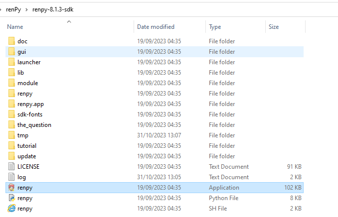
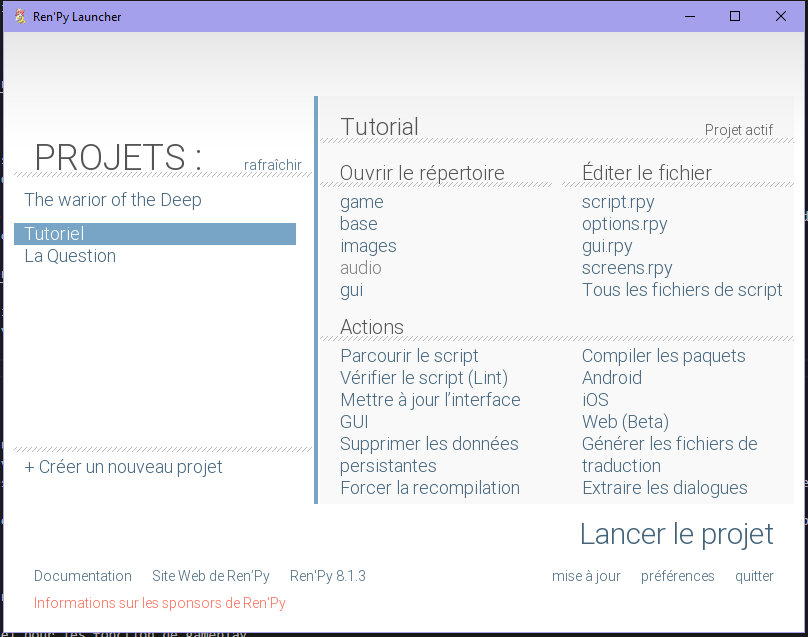

# WOTD GAME : project visual novel

## synopsis

Le but de ce git est de déposer le code permettant la compilation du jeux RenPy ayant pour thématique la guilde WOTD.

Projet en cours de création, en attente des besoin fonctionnel.

## instalation

<https://www.renpy.org/>

Vous pouvez dans le liens si dessus installer le moteur de jeux open source RenPy.
Celui ci vous permettra de complilé le code présent ici afin de le transformer en jeux pleinement fonctionnel.

Pour ce faire téléchargé RENPY Version 8.1.3 sur le site ou supérieur puis décompiller le projet à un endroit connue de votre ordinateur.
Une fois fait cherchez le fichier Renpy de type app dans le dossier, il s'agit de l'application vous permettant de lancer le jeux et le compiler en mode Dev.

Pour importer ce projet dans l'application Renpy, il vous faudra déplacer ce dossier (GAME) dans un dossier du nom du projet à la racine de l'application.
Une fois fait, vous pouvez simplement rafraichir l'affichage des projets, l'application devrait apparaite.

## Travailler en équipe

afin de travailler en équipe correctement, il faudra appliquer de bonne pratique technique et fonctionnel.
A savoir utiliser une division des tâches dites "Agile" correspondante chacune à une fonctionnalité unique du jeux.
Chaque tâche pourra alors être traité par une branche git indépendante qui sera jointe au projet principale une fois finalisé, cela permet de travailler sans se géner.

Il sera toujours possible de comuniquer entre nous chaque avancé ou idée nouvelle, alors n'hésitez pas à tout remettre en question.

## TODO

- Cahier des charge technico fonctionnel
- mind map
- Code basique fonctionnel pour les fonction de gameplay
- import de ressources audio et asset nécessaire
